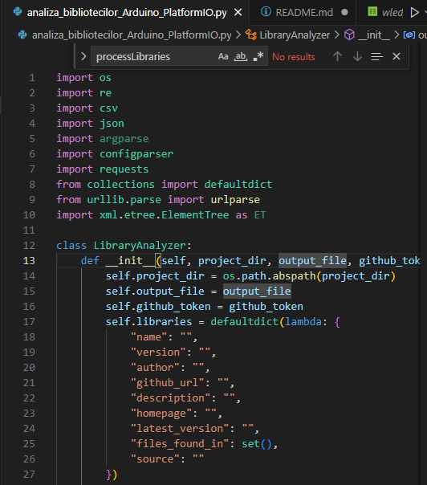
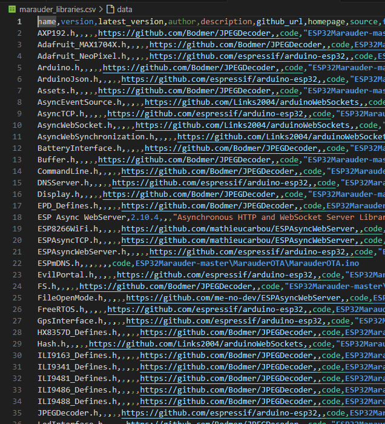
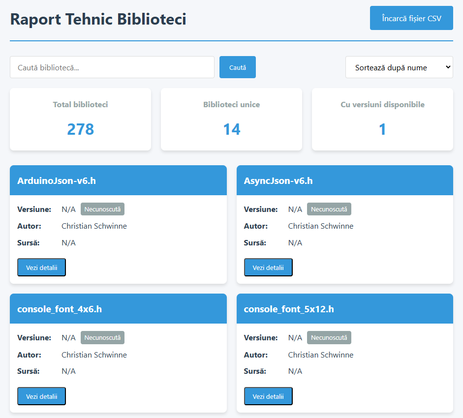
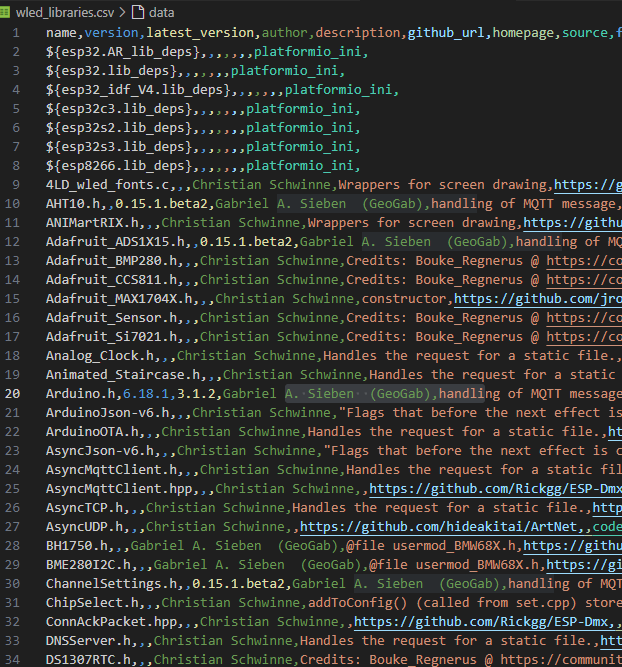

# Proiect de analiză a bibliotecilor Arduino și PlatformIO

Acest proiect permite analiza bibliotecilor folosite în proiectele Arduino și PlatformIO, crearea unui raport tehnic și vizualizarea acestuia într-o aplicație web interactivă.

## Descriere

Proiectul constă în două componente principale:
1. **Analiza Bibliotecilor** - Un script Python care analizează bibliotecile folosite în proiectele Arduino și PlatformIO, extrăgând date relevante și generând un fișier `.csv` cu informațiile bibliotecilor.
2. **Aplicația Web** - Un raport tehnic generat pe baza fișierului `.csv`, vizualizat într-o aplicație web interactivă, care include funcționalități de căutare, filtrare și sortare a bibliotecilor.

## Componente

### 1. Script Python: `analiza_bibliotecilor_Arduino_PlatformIO.py`
Acest script analizează fișierele de configurare ale proiectelor Arduino și PlatformIO și generează un fișier `.csv` care conține informațiile despre bibliotecile utilizate, cum ar fi:
- Numele bibliotecii
- Descrierea
- Autorul
- Versiunea
- GitHub URL
- Homepage
- Fișierele în care se regăsesc bibliotecile

### 2. Aplicația Web
Aplicația web include următoarele fișiere:
- `raport_tehnic.html`: Pagina principală a aplicației.
- `raport_tehnic.css`: Fișierul CSS pentru stilizarea paginii.
- `raport_tehnic.js`: JavaScript-ul care se ocupă cu procesarea fișierului CSV și interacțiunile utilizatorului (cercetarea, filtrarea și sortarea bibliotecilor).

## Instalare

Pentru a rula acest proiect, urmează pașii de mai jos:

### 1. Clonează repository-ul

```bash
git clone https://github.com/username/repository-name.git
cd repository-name
python -m venv venv
source venv/bin/activate  # pe Linux/Mac
venv\Scripts\activate     # pe Windows
pip install -r requirements.txt
python analiza_bibliotecilor_Arduino_PlatformIO.py

## Imagini

### Prezentare 1



### Prezentare 2



### Prezentare 3



### Prezentare 4



